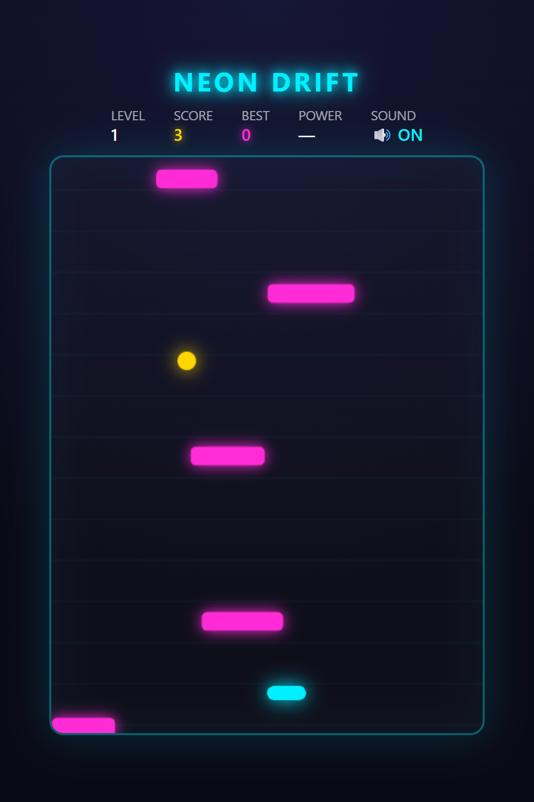
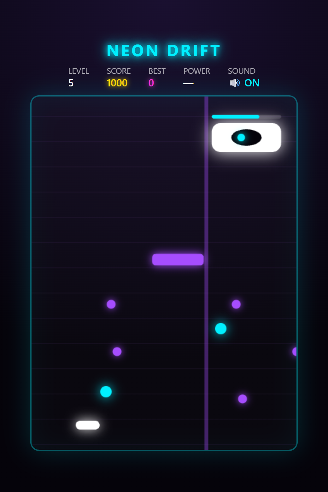

# Neon Drift 🎮

A fast, neon synthwave arcade dodger that runs entirely in your browser — **no build, no dependencies, no assets**. Everything (graphics, music, and sound) is generated procedurally in a single HTML file.



## ▶️ Play

Just open `index.html` in any modern browser, or play it live via GitHub Pages once enabled:

```
https://ralvid.github.io/neon-drift/
```

## How to play

- **Move:** ← → arrows, `A` / `D`, or your mouse
- **Dodge** the falling blocks
- **Grab gold orbs** for bonus points (+25)
- **Catch power-ups:**
  - 🛡️ **Shield** — blocks one hit
  - ⏱️ **Slow-Mo** — slows everything down
  - 🧲 **Magnet** — pulls nearby orbs to you
- **Survive** — speed ramps up the longer you last

## Levels

Climb through **5 levels**, each with its own music, color palette, and gameplay twist:

| Lvl | Name | Score | Twist |
|-----|------|-------|-------|
| 1 | Neon Drift | 0 | Calm synthwave intro |
| 2 | Magenta Rush | 150 | Denser blocks |
| 3 | Toxic Zone | 350 | Blocks drift sideways |
| 4 | Inferno | 600 | Fast & relentless |
| 5 | The Void | 1000 | Boss fight! |

### 👹 The Void Guardian (boss)

At Level 5 a boss appears. Damage it by collecting gold orbs while dodging its **aimed bullet volleys** and a **telegraphed sweeping laser**. It enrages as its HP drops. Defeat it for **+500** and an endless run.



## Audio

All music and sound effects are synthesized live with the **Web Audio API**:

- A procedural synthwave soundtrack that **changes per level** (key, tempo, chord progressions, waveforms)
- Intensity **scales with game speed** — tempo rises, the filter opens, and extra layers stack in
- A full synthesized **drum kit** (kick, snare, hi-hats, toms, crash)
- Toggle sound on/off in the HUD

## Tech

- Single self-contained `index.html` (HTML5 Canvas + vanilla JS + Web Audio API)
- Zero dependencies, fully offline

## License

[MIT](LICENSE)
